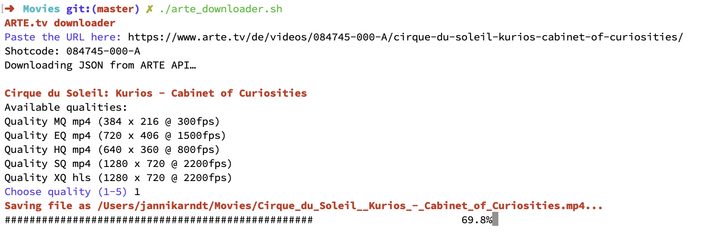

# Arte Downloader

Since movies in European public television are only available online for a _limited_ amount of time, you might want to download something before it's gone. This can help you.

# How-To

Run the script from Terminal:

```bash
./arte_downloader.sh
```

Paste the url of the video, select a quality, that's it.



# Dependencies

This script uses `curl`, `jq` and `sed`.
